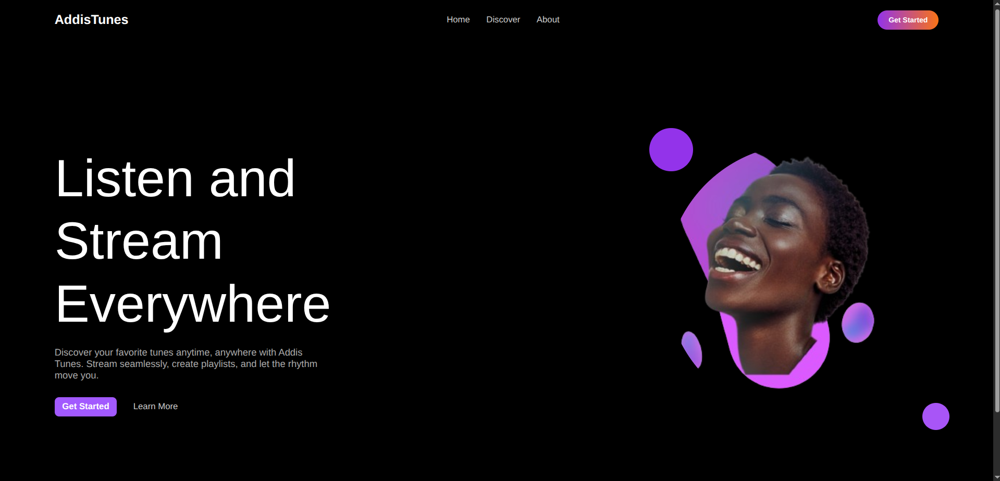
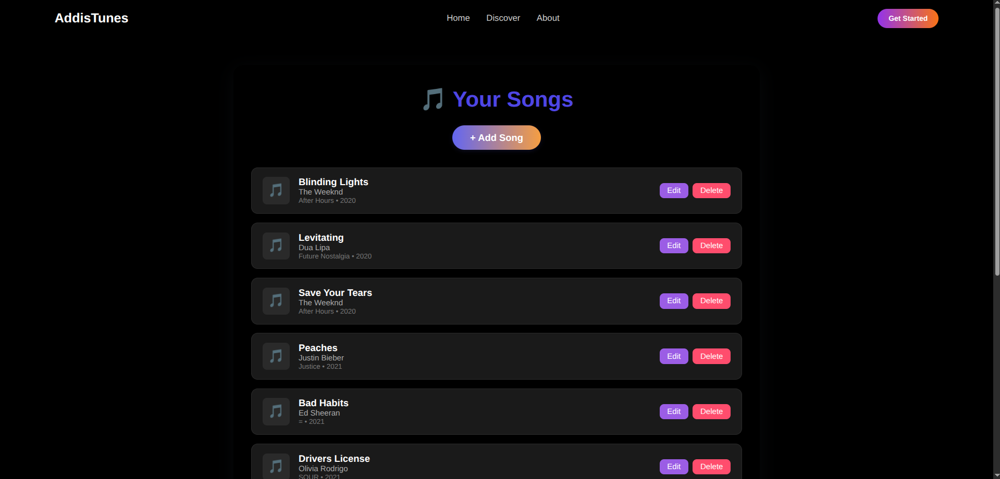
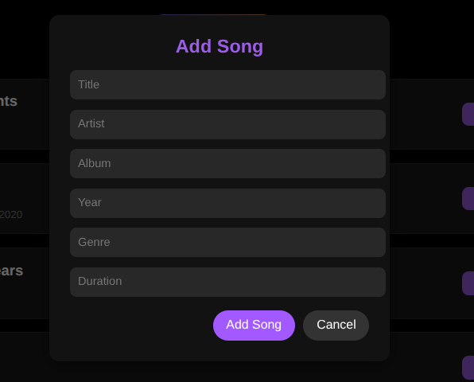

# AddisTunes




A full-stack music management application built with React, Node.js & Express. Easily manage songs with RESTful APIs.

---

## Table of Contents

- [Features](#features)
- [Tech Stack](#tech-stack)
- [Backend Setup](#backend-setup)
- [API Endpoints](#api-endpoints)
- [Environment Variables](#environment-variables)
- [Project Structure](#project-structure)
- [Frontend](#frontend)
- [Contributing](#contributing)
- [License](#license)

---

## Features

- Add, update, delete, and list songs
- Pagination support for listing songs
- MongoDB integration
- RESTful API design
- CORS enabled for frontend integration
- Logging with Morgan

## Tech Stack

- Node.js
- Express.js
- MongoDB (Mongoose)
- Morgan (logging)
- CORS
- dotenv

## Backend Setup

1. **Clone the repository:**

   ```sh
   git clone https://github.com/Kingestif/AddisTunes.git
   cd AddisTunes/Backend
   ```

2. **Install dependencies:**

   ```sh
   npm install
   ```

3. **Configure environment variables:**

   - Create a `.env` file in the `Backend` folder:
     ```
     MONGO_URL=your_mongodb_connection_string
     PORT=5000
     ```

4. **Run the server:**
   ```sh
   npm run dev
   ```
   The server will start on the port specified in `.env`.

## API Endpoints

Base URL: `/api/v1/songs`

| Method | Endpoint | Description                |
| ------ | -------- | -------------------------- |
| GET    | `/`      | List all songs (paginated) |
| POST   | `/`      | Add a new song             |
| GET    | `/:id`   | Get song by ID             |
| PATCH  | `/:id`   | Update song by ID          |
| DELETE | `/:id`   | Delete song by ID          |

### Example Song Object

```json
{
  "title": "Levitating",
  "artist": "Dua Lipa",
  "album": "Future Nostalgia",
  "year": 2020,
  "genre": "Pop",
  "duration": "3:23"
}
```

## Environment Variables

- `MONGO_URL`: MongoDB connection string
- `PORT`: Port for the server (default: 3000)

## Project Structure

```
ZemenayTunes/
├── Backend/
│   ├── app.js
│   ├── server.js
│   ├── package.json
│   ├── controllers/
│   │   └── songController.js
│   ├── models/
│   │   └── songs.js
│   ├── routes/
│   │   └── songRoutes.js
│   └── .env (not committed)
├── Frontend/
│   └── (empty for now)
└── README.md
```

## Frontend

The `Frontend` folder contains a full-featured React application for managing songs. It is deployed at:

**Live Demo:** [https://addis-music-ochre.vercel.app/](https://addis-music-ochre.vercel.app/)

### Features

- Modern React SPA with React Router for navigation
- Add, update, delete, and list songs (CRUD)
- Pagination support for listing songs
- Modal dialogs for editing, adding, and confirming deletion
- Responsive design with custom CSS
- API integration with the backend

### Tech Stack

- React (functional components, hooks)
- Redux Toolkit & Redux Saga for state management and async actions
- Custom CSS modules for styling
- Webpack for bundling and development
- Babel for JSX/ES6 transpilation
- Vercel for deployment

### Webpack Configuration Highlights

- Babel loader for JS/JSX files
- CSS loader and style loader for CSS modules
- Asset/resource loader for images and SVGs
- HtmlWebpackPlugin for HTML template
- DefinePlugin for environment variables (API base URL)
- SPA routing support with `publicPath: "/"` and `historyApiFallback`

### Project Structure

```
Frontend/
├── public/
│   ├── index.html
│   └── assets/
│       ├── bg7.png
│       └── podcast.svg
├── src/
│   ├── app.jsx
│   ├── index.js
│   ├── api/
│   │   └── songsApi.js
│   ├── components/
│   │   ├── AddSongModal.jsx/.css
│   │   ├── DeleteConfirmModal.jsx/.css
│   │   ├── EditSongModal.jsx/.css
│   │   ├── Footer.jsx/.css
│   │   ├── Header.jsx/.css
│   │   ├── HeroSection.jsx/.css
│   │   ├── Pagination.jsx/.css
│   │   ├── SongList.jsx/.css
│   │   └── SongsSection.jsx/.css
│   └── redux/
│       ├── songsSaga.js
│       ├── songsSlice.js
│       └── store.js
├── package.json
├── webpack.config.js
├── .babelrc
├── .env
└── vercel.json
```

### Deployment

- The frontend is deployed on Vercel for fast, global delivery.
- Webpack outputs to the `dist/` directory, configured in `vercel.json`.
- SPA routing is enabled via Vercel rewrites.
- Environment variables (e.g., `API_BASE_URL`) are set in the Vercel dashboard.

### How to Run Locally

1. **Install dependencies:**
   ```sh
   cd Frontend
   npm install
   ```
2. **Start the development server:**
   ```sh
   npm start
   ```
   The app will run at [http://localhost:5000](http://localhost:5000) by default.
3. **Build for production:**
   ```sh
   npm run build
   ```
   Output will be in the `dist/` directory.

---

## Contributing

Contributions are welcome! Please fork the repository and submit a pull request.

## License

This project is licensed under the ISC License.

---
